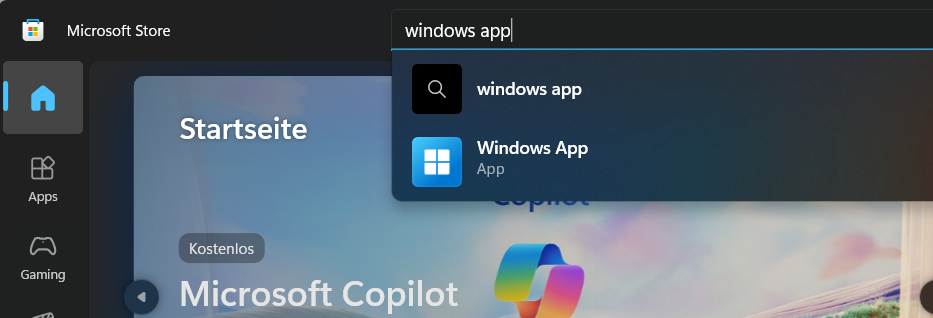

# Sandbox environment setup guide

You can access the environment by using a W365 desktop (recommended) or a separate (Edge) browser profile.

### 1. Install the W365 Store App

The most convenient way to access the environment is W365. All you need is the “Windows App” from the Microsoft Store: 

[https://apps.microsoft.com/detail/9N1F85V9T8BN?hl=de-degl=DEocid=pdpshare](https://apps.microsoft.com/detail/9N1F85V9T8BN?hl=de-de&gl=DE&ocid=pdpshare)

For MacOS, please follow the instructions: [Use the Windows app to connect to a cloud PC on macOS with Full Keyboard Access - Microsoft Support](https://support.microsoft.com/en-us/topic/use-the-windows-app-to-connect-to-a-cloud-pc-on-macos-with-full-keyboard-access-26627a45-7a8d-435c-8eb8-b3cf44a34943)
